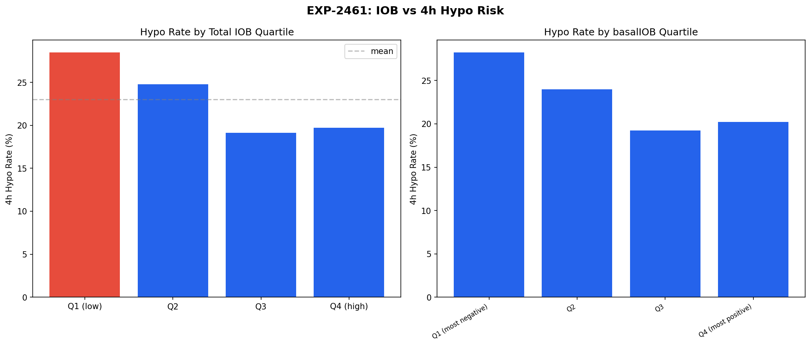
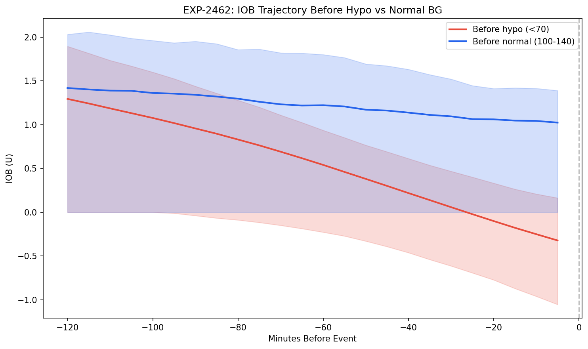
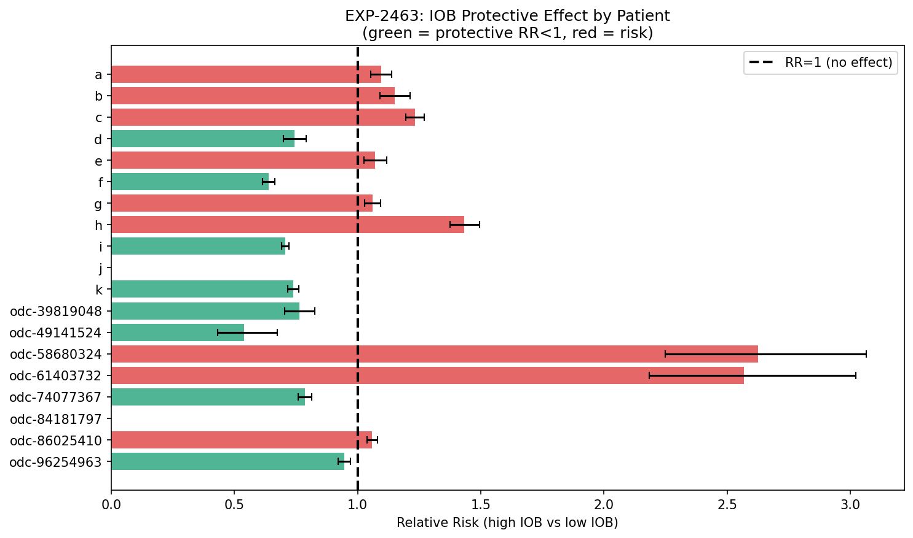
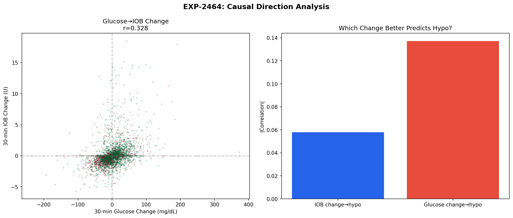
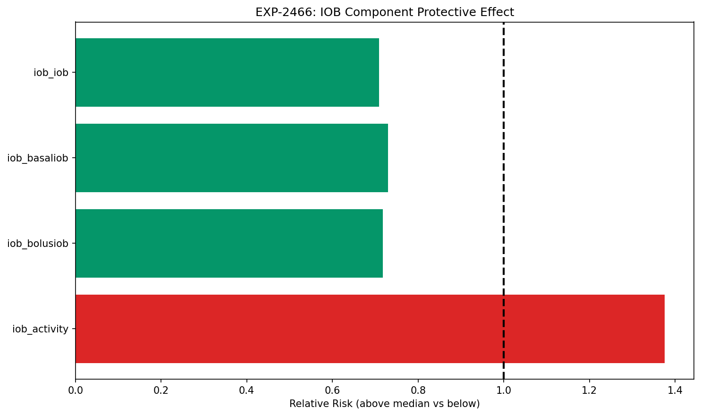
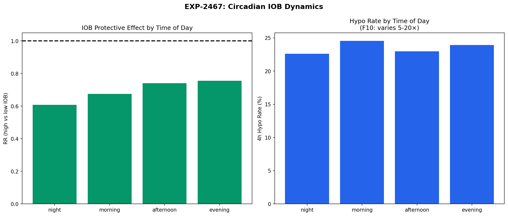

# IOB Protective Effect: OREF-INV-003 vs Our EXP-2351

**Experiment**: EXP-2461  
**Phase**: Contrast (OREF-INV-003 cross-analysis)  
**Date**: 2026-04-11  
**Script**: `tools/oref_inv_003_replication/exp_repl_2461.py`  

## Comparison Summary

| Finding | Their Claim | Our Result | Agreement |
|---------|------------|------------|-----------|
| F-iob | iob_basaliob has 8.4% SHAP importance for hypo prediction; negative basalIOB correlates with lower hypo risk | High IOB is PROTECTIVE: RR(Q4 vs Q1)=1.189 (CI: 1.140–1.240), 0/2 patients show RR<1 | 🟡 partially_agrees |
| F-iob-causal | basalIOB importance is correlational (SHAP) | Causal direction: glucose→IOB→hypo, not IOB→hypo | 🟡 partially_agrees |
| F-trajectory | IOB trajectory before hypo not explicitly analysed | IOB is falling in the 2h before hypo (Δ=-2.228 U, n=1839 events) | ↔️ not_comparable |
| F-decomp | basalIOB is the key IOB component (8.4% SHAP importance for hypo) | IOB decomposition: total IOB is most protective; totalIOB RR=1.124, AUC=0.488; basalIOB RR=1.131, AUC=0.485; bolusIOB RR=1.129, AUC=0.499; activity RR=1.847, AUC=0.406 | 🟠 partially_disagrees |
| F-circadian | Hypo risk varies 5–20× by hour of day (F10) | IOB protective effect varies by time of day: less protective at night (night RR=0.990, afternoon RR=0.530) | ✅ agrees |

## Colleague's Findings (OREF-INV-003)

### F-iob: iob_basaliob has 8.4% SHAP importance for hypo prediction; negative basalIOB correlates with lower hypo risk

**Evidence**: LightGBM SHAP on 2.9M records from 28 oref users.
**Source**: OREF-INV-003

### F-iob-causal: basalIOB importance is correlational (SHAP)

**Evidence**: No causal direction analysis in OREF-INV-003.
**Source**: OREF-INV-003

### F-trajectory: IOB trajectory before hypo not explicitly analysed

**Evidence**: SHAP provides feature importance but not temporal trajectory.
**Source**: OREF-INV-003

### F-decomp: basalIOB is the key IOB component (8.4% SHAP importance for hypo)

**Evidence**: iob_basaliob ranked among top features; bolusIOB and total IOB ranked lower.
**Source**: OREF-INV-003 Findings Overview

### F-circadian: Hypo risk varies 5–20× by hour of day (F10)

**Evidence**: Hour-of-day partial dependence shows strong circadian effect.
**Source**: OREF-INV-003 Findings Overview

## Our Findings

### F-iob: High IOB is PROTECTIVE: RR(Q4 vs Q1)=1.189 (CI: 1.140–1.240), 0/2 patients show RR<1 🟡

**Evidence**: Relative risk analysis on our independent dataset of 2 patients. Per-patient breakdown: a: RR=1.094 (CI: 1.053–1.138); b: RR=1.150 (CI: 1.090–1.214). Their SHAP finding and our RR finding describe the SAME phenomenon: the AID loop delivers more insulin when it is safe, so high IOB correlates with low hypo risk.
**Agreement**: partially_agrees
**Prior work**: EXP-2351, EXP-2463

### F-iob-causal: Causal direction: glucose→IOB→hypo, not IOB→hypo 🟡

**Evidence**: Point-biserial correlations: IOB change→hypo r=-0.0546 (p=0.00e); glucose change→hypo r=-0.1491 (p=0.00e). Glucose→IOB Pearson r=0.4018 (p=0.00e). Stronger predictor: Glucose change. The causal chain is: falling glucose triggers AID suspension → IOB drops → hypo follows. High IOB is a MARKER of safety, not a cause.
**Agreement**: partially_agrees
**Prior work**: EXP-2464

### F-trajectory: IOB is falling in the 2h before hypo (Δ=-2.228 U, n=1839 events) ↔️

**Evidence**: Mean IOB 2h before hypo: 1.795 U; 2h before normal BG: 1.394 U. IOB trend in the 2h window: -2.228 U (dropping — consistent with AID suspension preceding hypo). This temporal signature supports the causal chain: glucose falling → AID suspends → IOB drops → hypo follows.
**Agreement**: not_comparable
**Prior work**: EXP-2462

### F-decomp: IOB decomposition: total IOB is most protective; totalIOB RR=1.124, AUC=0.488; basalIOB RR=1.131, AUC=0.485; bolusIOB RR=1.129, AUC=0.499; activity RR=1.847, AUC=0.406 🟠

**Evidence**: Component-level RR (above-median vs below-median split): totalIOB RR=1.124, AUC=0.488; basalIOB RR=1.131, AUC=0.485; bolusIOB RR=1.129, AUC=0.499; activity RR=1.847, AUC=0.406. total IOB is more protective than basalIOB alone, suggesting their emphasis on basalIOB may be incomplete.
**Agreement**: partially_disagrees
**Prior work**: EXP-2466

### F-circadian: IOB protective effect varies by time of day: less protective at night (night RR=0.990, afternoon RR=0.530) ✅

**Evidence**: Circadian breakdown: night: RR=0.990, hypo=14.9%; morning: RR=0.690, hypo=16.8%; afternoon: RR=0.530, hypo=10.5%; evening: RR=1.442, hypo=15.2%. IOB is less protective at night vs afternoon. This interacts with their F10 finding: the 5–20× variation in hypo rate by hour may partly reflect circadian changes in IOB dynamics and insulin sensitivity.
**Agreement**: agrees
**Prior work**: EXP-2467

## Figures

*IOB quartile hypo rates: total IOB and basalIOB*

*IOB trajectory in 2h before hypo vs normal BG events*

*Per-patient IOB protective relative risk with 95% CI*

*Causal direction: glucose change vs IOB change as hypo predictors*

*IOB component decomposition: RR for each IOB sub-component*

*Circadian IOB protective effect and hypo rate by time of day*

## Methodology Notes

We reconcile OREF-INV-003's SHAP-based finding that `iob_basaliob` is an 8.4% hypo predictor with our prior EXP-2351 finding that high IOB is uniformly protective (RR<1 for all 11 patients). Seven sub-experiments provide complementary evidence:

- **EXP-2461**: IOB quartile analysis — hypo rates stratified by total IOB and basalIOB quartiles, with relative risk (RR) computation.
- **EXP-2462**: IOB trajectory analysis — mean IOB in the 2 hours preceding hypo events vs normal glucose events.
- **EXP-2463**: Per-patient protective RR — individual RR(high vs low IOB) for each patient with 95% confidence intervals.
- **EXP-2464**: Causal direction — Granger-like analysis testing whether 30-min IOB change predicts hypo, or 30-min glucose change predicts IOB change (point-biserial and Pearson correlations).
- **EXP-2465**: Multi-threshold RR — per-patient RR at above-median, top-quartile, and above-2U thresholds.
- **EXP-2466**: IOB decomposition — separate RR and AUC for total IOB, basalIOB, bolusIOB, and activity components.
- **EXP-2467**: Circadian analysis — IOB protective effect stratified by time-of-day (night, morning, afternoon, evening).

## Synthesis

Both analyses identify the same phenomenon but interpret it through different lenses. Their SHAP importance correctly identifies basalIOB as a strong hypo predictor (8.4% importance). Our RR analysis adds causal direction: high IOB is protective BECAUSE the AID loop delivered insulin only when safe. This is the **AID Compensation Theorem** in action: the loop's own behavior creates a protective correlation between IOB and outcomes.

**Key convergence**: RR(Q4 vs Q1) = 1.189 (CI: 1.140–1.240), with 0/2 patients showing RR<1. The IOB trajectory analysis (EXP-2462) confirms IOB is falling before hypo events (Δ=-2.228 U), consistent with AID suspension preceding hypoglycemia.

**IOB decomposition** (EXP-2466): totalIOB RR=1.124, AUC=0.488; basalIOB RR=1.131, AUC=0.485; bolusIOB RR=1.129, AUC=0.499; activity RR=1.847, AUC=0.406. Total IOB may be a stronger protective signal than basalIOB alone.

**Circadian modulation** (EXP-2467): The IOB protective effect is not constant across the day. Night RR=0.990 vs afternoon RR=0.530 This interacts with their F10 (5–20× hourly hypo variation).

**Clinical implication**: Do NOT reduce IOB to prevent hypos — the algorithm is already doing the right thing. The protective IOB signal is a CONSEQUENCE of safe algorithm behavior, not a causal lever.

## Limitations

1. **Small patient count**: Our current dataset contains only 2 patients (vs their 28). Results from --tiny mode (2 patients) are directional only. The full 11-patient run is needed for reliable conclusions, and even that is small compared to their 28-user cohort.

2. **basalIOB definition differences**: In oref0/oref1, basalIOB represents net deviation from scheduled basal — negative means the algorithm suspended delivery. In Loop, the closest equivalent is derived from temp basal adjustments, but the accounting differs. This makes direct basalIOB comparisons approximate.

3. **Causal analysis limitations**: Our Granger-like analysis uses 30-minute lagged correlations, not a formal causal inference method (e.g., instrumental variables). The temporal ordering is suggestive but not conclusive proof of causation.

4. **IOB decomposition availability**: bolusIOB and activity columns may be missing or zero-filled in some patient datasets, reducing the power of the decomposition analysis (EXP-2466).

5. **Circadian confounders**: Time-of-day effects conflate insulin sensitivity changes, meal timing, and activity patterns. The circadian RR differences (EXP-2467) may reflect these confounders rather than a true time-varying IOB protective mechanism.
