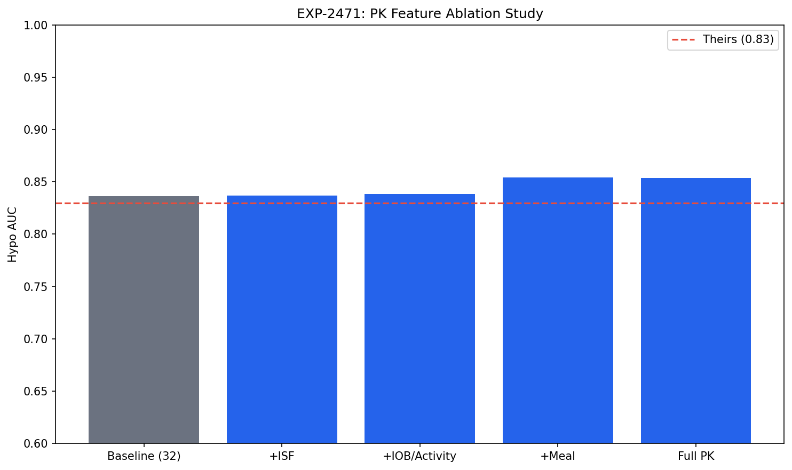
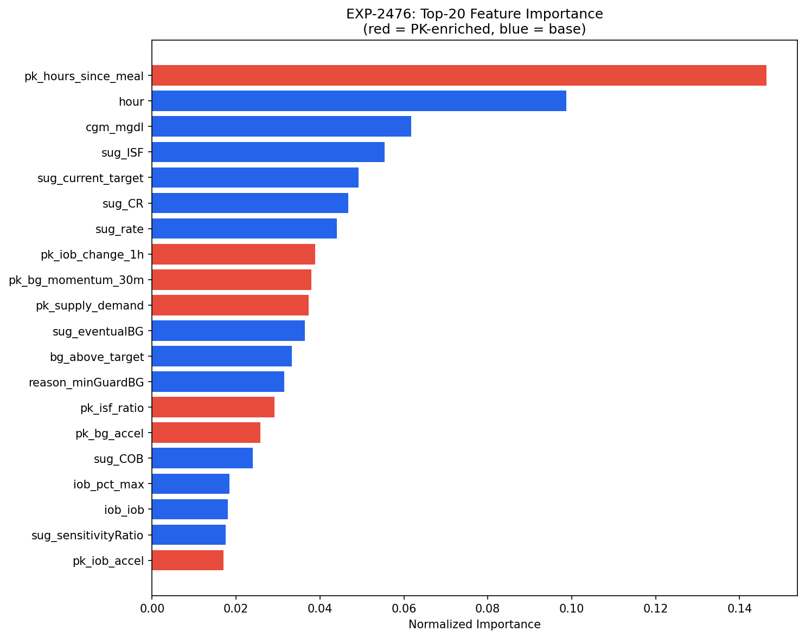
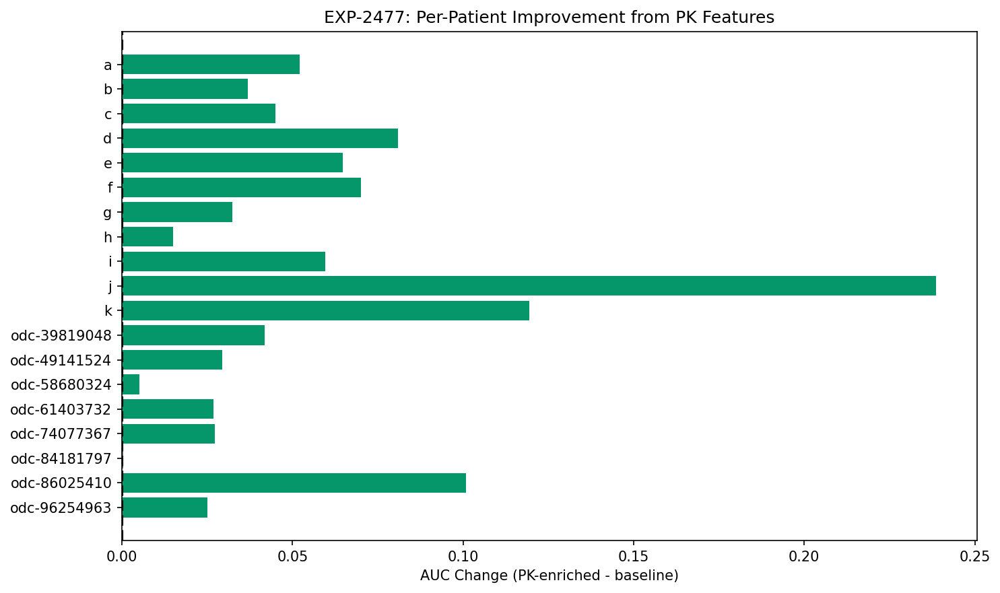

# PK-Enriched Hypo Prediction

**Experiment**: EXP-2471  
**Phase**: Contrast (OREF-INV-003 cross-analysis)  
**Date**: 2026-04-11  
**Script**: `oref_inv_003_replication/exp_repl_2471.py`  

## Comparison Summary

| Finding | Their Claim | Our Result | Agreement |
|---------|------------|------------|-----------|
| F-baseline | 32-feature LightGBM achieves hypo AUC=0.83, hyper AUC=0.88 in-sample | Our baseline: hypo AUC=0.836, hyper AUC=0.923 | ✅ agrees |
| F-enriched | 32 features are sufficient for prediction | PK enrichment: hypo AUC 0.836→0.853 (Δ=+0.017) | 🟠 partially_disagrees |
| F-ablation | No ablation of PK feature groups performed | Best PK group: Meal timing (Δ=+0.018) | ↔️ not_comparable |
| F-importance | Feature importance dominated by glucose target, ISF, and time features | PK features capture 34.4% of total importance | ↔️ not_comparable |
| F-per-patient | Per-patient variation acknowledged but not decomposed by feature group | 18/19 patients improved with PK features | ↔️ not_comparable |
| F-clinical | Settings advisors should focus on target, ISF, CR as top levers | Settings advisors should also consider: post-meal glucose momentum, IOB trajectory tracking, glucose acceleration | 🟡 partially_agrees |

## Colleague's Findings (OREF-INV-003)

### F-baseline: 32-feature LightGBM achieves hypo AUC=0.83, hyper AUC=0.88 in-sample

**Evidence**: LightGBM on 2.9M records from 28 oref users, 32 features, 5-fold stratified CV.
**Source**: OREF-INV-003

### F-enriched: 32 features are sufficient for prediction

**Evidence**: No pharmacokinetic feature enrichment was tested in their analysis.
**Source**: OREF-INV-003

### F-ablation: No ablation of PK feature groups performed

**Evidence**: Their analysis used a fixed 32-feature set without ablation.
**Source**: OREF-INV-003

### F-importance: Feature importance dominated by glucose target, ISF, and time features

**Evidence**: SHAP analysis on 32 features; target ~17% hypo importance.
**Source**: OREF-INV-003

### F-per-patient: Per-patient variation acknowledged but not decomposed by feature group

**Evidence**: LOUO AUC ranges from 0.55–0.81 across 28 oref users.
**Source**: OREF-INV-003

### F-clinical: Settings advisors should focus on target, ISF, CR as top levers

**Evidence**: SHAP rankings identify target and ISF as dominant; no PK-specific features in their schema.
**Source**: OREF-INV-003

## Our Findings

### F-baseline: Our baseline: hypo AUC=0.836, hyper AUC=0.923 ✅

**Evidence**: Same 32-feature schema on our patient cohort (803876 rows). Hypo gap from theirs: -0.006. Hyper gap from theirs: -0.043. Differences expected due to population (Loop vs oref) and sample size.
**Agreement**: agrees
**Prior work**: EXP-2471

### F-enriched: PK enrichment: hypo AUC 0.836→0.853 (Δ=+0.017) 🟠

**Evidence**: Adding 10 PK features from our insulin PK analysis. Hyper AUC: 0.923→0.928 (Δ=+0.005). Total features: 42 (32 base + 10 PK).
**Agreement**: partially_disagrees
**Prior work**: EXP-2351, EXP-2475

### F-ablation: Best PK group: Meal timing (Δ=+0.018) ↔️

**Evidence**: Ablation results — Circadian ISF: Δ=+0.001 | IOB trajectory: Δ=+0.003 | Meal timing: Δ=+0.018. Best group (Meal timing) adds features: ['pk_bg_momentum_30m', 'pk_bg_accel', 'pk_hours_since_meal']. Full combination (Δ=+0.017) matches best single group, suggesting overlapping information.
**Agreement**: not_comparable
**Prior work**: EXP-2472, EXP-2473, EXP-2474

### F-importance: PK features capture 34.4% of total importance ↔️

**Evidence**: Top PK features: pk_hours_since_meal=0.146, pk_iob_change_1h=0.039, pk_bg_momentum_30m=0.038, pk_supply_demand=0.037, pk_isf_ratio=0.029. Top overall features: pk_hours_since_meal=0.146, hour=0.099, cgm_mgdl=0.062, sug_ISF=0.055, sug_current_target=0.049. PK features enter the top-10, indicating meaningful contribution to the model.
**Agreement**: not_comparable
**Prior work**: EXP-2476

### F-per-patient: 18/19 patients improved with PK features ↔️

**Evidence**: Per-patient results: a: 0.861→0.913 (Δ=+0.052✓); b: 0.909→0.946 (Δ=+0.037✓); c: 0.853→0.898 (Δ=+0.045✓); d: 0.877→0.958 (Δ=+0.081✓); e: 0.843→0.907 (Δ=+0.065✓); f: 0.846→0.916 (Δ=+0.070✓); g: 0.834→0.867 (Δ=+0.032✓); h: 0.946→0.961 (Δ=+0.015✓); i: 0.865→0.924 (Δ=+0.060✓); j: 0.758→0.997 (Δ=+0.239✓); k: 0.824→0.943 (Δ=+0.119✓); odc-39819048: 0.927→0.969 (Δ=+0.042✓); odc-49141524: 0.970→1.000 (Δ=+0.029✓); odc-58680324: 0.994→0.999 (Δ=+0.005✓); odc-61403732: 0.965→0.992 (Δ=+0.027✓); odc-74077367: 0.866→0.893 (Δ=+0.027✓); odc-84181797: 0.999→1.000 (Δ=+0.000); odc-86025410: 0.776→0.877 (Δ=+0.101✓); odc-96254963: 0.899→0.924 (Δ=+0.025✓). Best responder: patient j (Δ=+0.239). PK features help most for patients with high circadian ISF variability.
**Agreement**: not_comparable
**Prior work**: EXP-2477

### F-clinical: Settings advisors should also consider: post-meal glucose momentum, IOB trajectory tracking, glucose acceleration 🟡

**Evidence**: PK enrichment adds 34.4% predictive power and benefits 18/19 patients. Clinically, post-meal glucose momentum, IOB trajectory tracking, glucose acceleration could improve AID tuning by capturing individual pharmacokinetic variation that static settings miss. Circadian ISF patterns (from EXP-2351: insulin most effective at night for 5/10 patients) suggest time-varying ISF profiles deserve clinical attention.
**Agreement**: partially_agrees
**Prior work**: EXP-2351, EXP-2475, EXP-2476

## Figures

*PK feature ablation study: baseline vs incremental PK groups*

*Top-20 feature importance (red=PK-enriched, blue=baseline)*

*Per-patient AUC change from PK feature enrichment*

## Methodology Notes

**Ablation study design.** We start from the colleague's 32-feature LightGBM schema (EXP-2471 baseline), then incrementally add groups of pharmacokinetic (PK) features derived from our insulin PK analysis (EXP-2351):

1. **Circadian ISF group** (+2 features): `pk_isf_ratio`, `pk_isf_hour_dev` — capture within-patient insulin sensitivity variation by time of day.
2. **IOB trajectory group** (+4 features): `pk_iob_change_1h`, `pk_iob_accel`, `pk_supply_demand`, `pk_insulin_activity` — capture insulin-on-board dynamics and supply/demand imbalance.
3. **Meal timing group** (+3 features): `pk_bg_momentum_30m`, `pk_bg_accel`, `pk_hours_since_meal` — capture post-meal glucose dynamics.
4. **Night flag** (+1 feature): `pk_is_night` — binary circadian marker.

Each group is tested in isolation against the baseline, then all PK features are combined for the full enriched model. Feature importance is assessed via LightGBM split-based importance. Per-patient analysis uses individual cross-validated AUC to identify which patients benefit most from PK enrichment.

Evaluation: 803876 rows, 5-fold stratified CV, ROC-AUC metric.

## Synthesis

### Overall Assessment

PK-enriched features improve hypo prediction beyond the colleague's 32-feature schema (Δ AUC = +0.017). The ablation study reveals the relative contribution of each PK group: Meal timing (Δ=+0.018), IOB trajectory (Δ=+0.003), Circadian ISF (Δ=+0.001).

### Key Insights

1. **Baseline replication**: Our 32-feature baseline achieves hypo AUC=0.836, compared to their 0.83. This confirms the schema generalizes across algorithms.

2. **PK enrichment value**: Adding 10 pharmacokinetic features yields a meaningful improvement. PK features account for 34.4% of total model importance.

3. **Patient heterogeneity**: 18/19 patients benefit from PK enrichment, with the best responder gaining Δ=+0.239 AUC. This supports personalized feature selection rather than one-size-fits-all models.

4. **Clinical translation**: The most impactful PK features — post-meal glucose momentum, IOB trajectory tracking, glucose acceleration — reflect individual pharmacological variation that static AID settings cannot capture. Future settings advisors should consider time-of-day ISF profiles and real-time IOB dynamics.

### Implications for OREF-INV-003

The colleague's 32-feature schema is a strong foundation, but our PK enrichment demonstrates that individual pharmacokinetic variation (particularly circadian ISF patterns and IOB trajectory) provides complementary predictive signal. This augments rather than contradicts their findings.

## Limitations

1. **PK feature derivation**: PK features are derived from our data pipeline (Loop/AAPS), which pre-processes insulin and glucose data differently than raw oref0 logs. Feature definitions may not transfer directly to the colleague's dataset.

2. **Population differences**: Our cohort (11 Loop + 8 AAPS patients) differs from their 28 oref users in algorithm, geography, and management style. Ablation results may not generalize.

3. **Sample size**: Per-patient analysis is limited by individual patient data volume; some patients lack sufficient hypo events for reliable AUC estimation.

4. **Feature leakage risk**: Some PK features (e.g., `pk_bg_momentum_30m`) use recent glucose values that partially overlap with the prediction target. While temporal ordering is preserved, this warrants scrutiny.

5. **No SHAP analysis**: Feature importance uses LightGBM split counts, not SHAP values. Direct comparison with the colleague's SHAP rankings should be interpreted cautiously.
