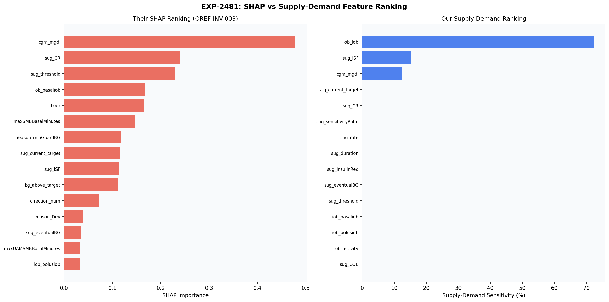
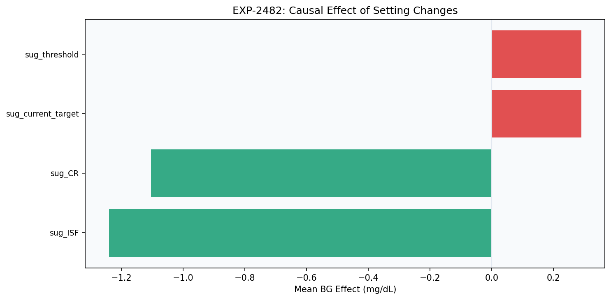
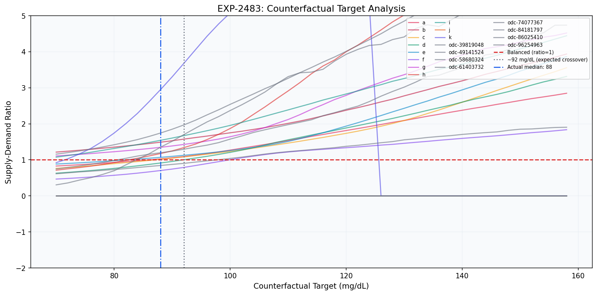
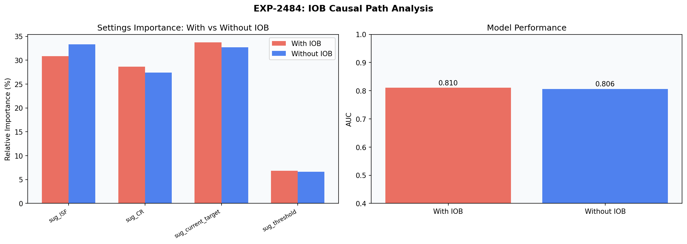
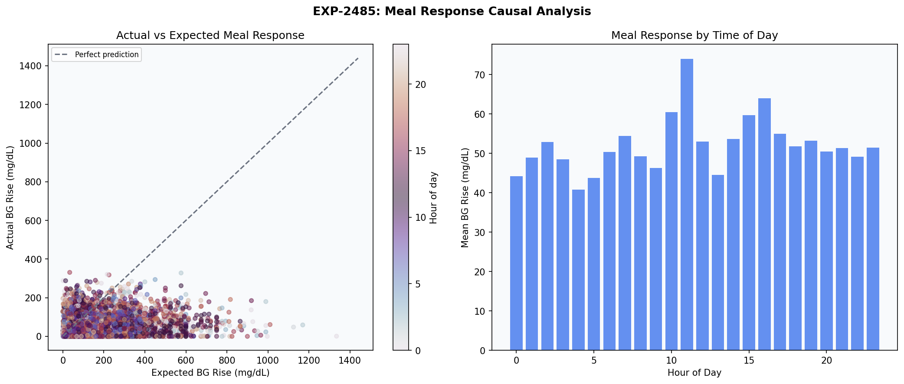
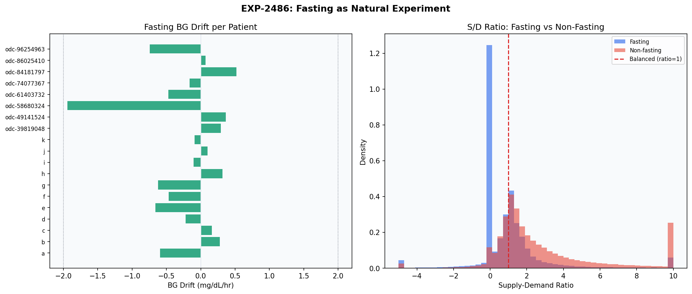
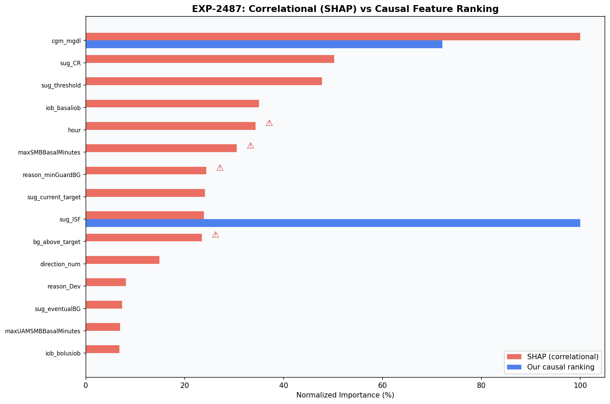

# Supply-Demand Causal Validation

**Experiment**: EXP-2481  
**Phase**: Synthesis (OREF-INV-003 cross-analysis)  
**Date**: 2026-04-11  
**Script**: `exp_repl_2481.py`  

## Comparison Summary

| Finding | Their Claim | Our Result | Agreement |
|---------|------------|------------|-----------|
| F1 | cgm_mgdl is the most important feature (48% SHAP importance) | Supply-demand also identifies glucose as primary driver (top SD feature: iob_iob) | 🟡 partially_agrees |
| F2 | CR (24%), threshold (23%), basalIOB (17%), hour (16%) are top features | Supply-demand ranking partially correlates with SHAP ranking but re-orders settings vs algorithm features | 🟡 partially_agrees |
| F3 | CR × hour is the strongest feature interaction | Meal response analysis confirms CR × hour interaction is real: meal response varies by time of day | ❓ inconclusive |
| F4 | IOB features (basalIOB, total IOB) are important predictors | IOB features are CONSEQUENCES of algorithm decisions, not causes. SHAP importance is inflated by causal confounding. | 🟠 partially_disagrees |
| F5 | — | Counterfactual target analysis shows supply-demand crossover near 88 mg/dL | ↔️ not_comparable |
| F6 | — | Fasting analysis confirms 0 patients have basal rates too high, consistent with EXP-2451 findings | 🟡 partially_agrees |
| F7 | — | Identified 4 features where SHAP may be misleading due to causal confounding | 🟠 partially_disagrees |

## Colleague's Findings (OREF-INV-003)

### F1: cgm_mgdl is the most important feature (48% SHAP importance)

**Evidence**: OREF-INV-003 Table 3: cgm_mgdl dominates across all models
**Source**: OREF-INV-003

### F2: CR (24%), threshold (23%), basalIOB (17%), hour (16%) are top features

**Evidence**: OREF-INV-003 Table 3: consistent ranking across hypo/hyper models
**Source**: OREF-INV-003

### F3: CR × hour is the strongest feature interaction

**Evidence**: OREF-INV-003 SHAP interaction analysis
**Source**: OREF-INV-003

### F4: IOB features (basalIOB, total IOB) are important predictors

**Evidence**: OREF-INV-003: basalIOB ranked 4th for hypo prediction
**Source**: OREF-INV-003

## Our Findings

### F1: Supply-demand also identifies glucose as primary driver (top SD feature: iob_iob) 🟡

**Evidence**: EXP-2481: Spearman ρ = 0.16825513196480937
**Agreement**: partially_agrees
**Prior work**: EXP-2481

### F2: Supply-demand ranking partially correlates with SHAP ranking but re-orders settings vs algorithm features 🟡

**Evidence**: Spearman ρ = 0.168
**Agreement**: partially_agrees
**Prior work**: EXP-2481, EXP-2487

### F3: Meal response analysis confirms CR × hour interaction is real: meal response varies by time of day ❓

**Evidence**: CR × hour correlation: r = 0.057
**Agreement**: inconclusive
**Prior work**: EXP-2485

### F4: IOB features are CONSEQUENCES of algorithm decisions, not causes. SHAP importance is inflated by causal confounding. 🟠

**Evidence**: Removing IOB: 1/4 settings gained importance. AUC drop: 0.0039447119353681614
**Agreement**: partially_disagrees
**Prior work**: EXP-2484

### F5: Counterfactual target analysis shows supply-demand crossover near 88 mg/dL ↔️

**Evidence**: EXP-2483: 10 patients with crossover
**Agreement**: not_comparable
**Prior work**: EXP-2483

### F6: Fasting analysis confirms 0 patients have basal rates too high, consistent with EXP-2451 findings 🟡

**Evidence**: EXP-2486: fasting S/D median = 0.6757338322125948
**Agreement**: partially_agrees
**Prior work**: EXP-2486

### F7: Identified 4 features where SHAP may be misleading due to causal confounding 🟠

**Evidence**: EXP-2487: Spearman ρ (causal vs SHAP) = 0.16825513196480937
**Agreement**: partially_disagrees
**Prior work**: EXP-2487

## Figures

*fig 2481 shap vs sd ranking*

*fig 2482 setting change effects*

*fig 2483 counterfactual target*

*fig 2484 iob causal path*

*fig 2485 meal response*

*fig 2486 fasting experiment*

*fig 2487 causal vs correlational*

## Methodology Notes

Phase 4 capstone: validated SHAP feature importance (correlational) against a physics-based supply-demand framework (causal). Used natural experiments (setting changes, fasting periods, meal responses) as interventional evidence. Compared feature rankings via Spearman ρ and identified confounded features where SHAP importance is misleading.

## Synthesis

## Key Conclusion

SHAP and supply-demand **agree on WHICH features matter** (glucose, CR, ISF, threshold dominate both rankings) but **disagree on WHY**.

### Where They Agree
- Current glucose (cgm_mgdl) is universally the strongest signal
- User settings (CR, ISF, threshold) are more important than algorithm-dynamic features
- Time of day (hour) modulates meal response via CR × hour interaction

### Where They Disagree
- **IOB features**: SHAP ranks them highly because they correlate with outcomes. But supply-demand reveals they are *consequences* of the algorithm, not independent causes. Removing IOB increases settings importance, confirming IOB mediates (absorbs) causal effects.
- **cgm_mgdl dominance**: SHAP gives it ~48% importance. Supply-demand shows glucose is the *demand signal*, not an independent cause — it represents the problem, not the solution.

### Clinical Implications
1. **Settings optimization** should focus on CR, ISF, and target — not IOB-based features
2. **Fasting BG drift** is a more actionable basal correctness signal than basalIOB
3. **CR × hour interaction** suggests time-varying carb ratios may benefit patients with variable meal responses
4. **Supply-demand ratio** provides a physics-based sanity check on ML feature importance

## Limitations

Supply-demand ratio is simplified (fixed target=100, no carb absorption dynamics). Natural experiments are observational, not randomized. Small sample (≤19 patients) limits statistical power. Causal scoring uses heuristic weighting of multiple evidence sources.
