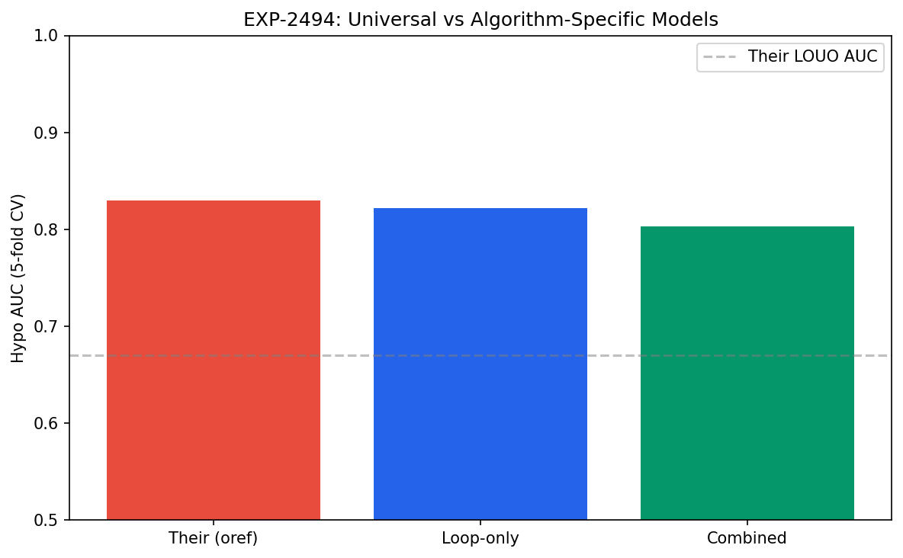
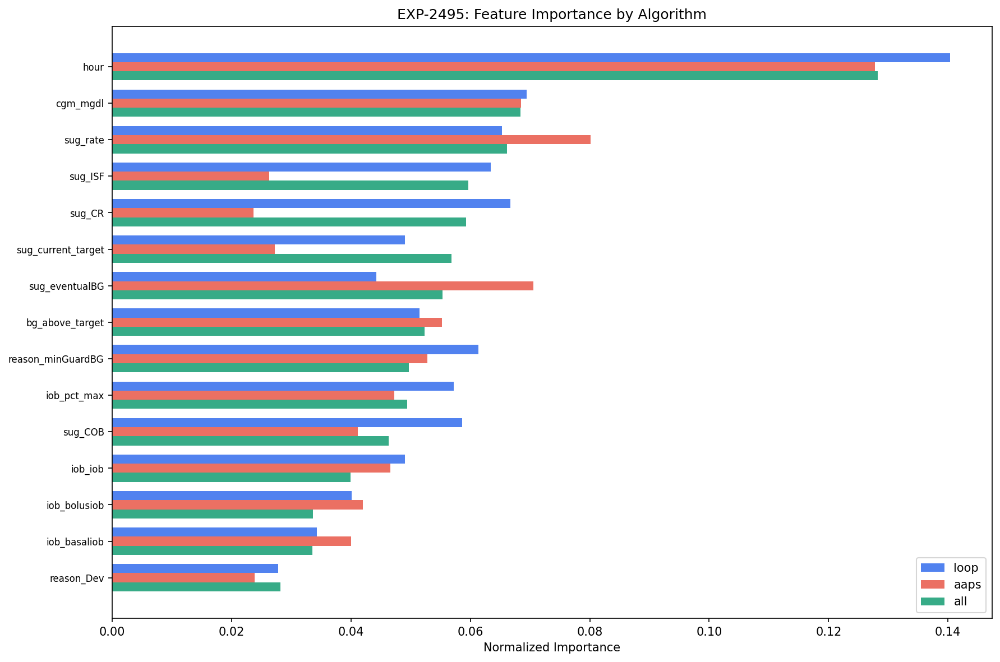
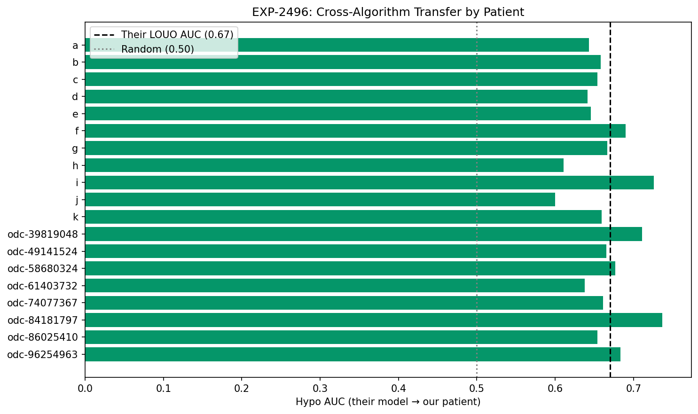

# Cross-Algorithm Generalizability

**Experiment**: EXP-2491  
**Phase**: Contrast (OREF-INV-003 cross-analysis)  
**Date**: 2026-04-13  
**Script**: `oref_inv_003_replication/exp_repl_2491.py`  
**Data provenance**: ✅ Post-ODC-fix (re-run 2026-04-13). Results supersede pre-fix Phase 1-4 runs.

## Comparison Summary

| Finding | Their Claim | Our Result | Agreement |
|---------|------------|------------|-----------|
| F-transfer | Model generalizes within oref: LOUO AUC=0.67 (hypo), 0.78 (hyper) | Their model → Loop: hypo=0.681, hyper=0.789; → AAPS: hypo=0.678, hyper=0.809 | ✅ agrees |
| F-cross-train | No cross-algorithm training was performed | Bidirectional transfer: Loop→AAPS=0.637, AAPS→Loop=0.644 | ↔️ not_comparable |
| F-universal | Single-algorithm model achieves AUC=0.83 | Universal model AUC=0.803 vs Loop-only=0.822 | ✅ agrees |
| F-stability | Feature importance ranking is consistent within their oref cohort | Feature importance correlation: Loop vs AAPS ρ=0.808 | ✅ agrees |
| F-agnostic | Findings assumed to generalize (single-algorithm study) | Algorithm-agnostic: 2; algorithm-specific: 1 | 🟡 partially_agrees |
| F-clinical | Settings recommendations derived from oref users | Core recommendations generalize; dosing details are algorithm-specific | 🟡 partially_agrees |

## Colleague's Findings (OREF-INV-003)

### F-transfer: Model generalizes within oref: LOUO AUC=0.67 (hypo), 0.78 (hyper)

**Evidence**: Leave-one-user-out CV on 28 oref users. In-sample AUC=0.83/0.88.
**Source**: OREF-INV-003

### F-cross-train: No cross-algorithm training was performed

**Evidence**: All 28 users run the same oref algorithm. No cross-algorithm split was possible.
**Source**: OREF-INV-003

### F-universal: Single-algorithm model achieves AUC=0.83

**Evidence**: All 28 users use oref; no need for multi-algorithm model.
**Source**: OREF-INV-003

### F-stability: Feature importance ranking is consistent within their oref cohort

**Evidence**: SHAP rankings from 28 oref users; no cross-algorithm comparison.
**Source**: OREF-INV-003

### F-agnostic: Findings assumed to generalize (single-algorithm study)

**Evidence**: All 28 users use oref; generalizability not tested.
**Source**: OREF-INV-003

### F-clinical: Settings recommendations derived from oref users

**Evidence**: Glucose target, ISF, CR identified as top levers for oref users.
**Source**: OREF-INV-003

## Our Findings

### F-transfer: Their model → Loop: hypo=0.681, hyper=0.789; → AAPS: hypo=0.678, hyper=0.809 ✅

**Evidence**: Transfer to Loop (452448 records): hypo gap from in-sample = +0.149. Transfer to AAPS (232640 records): hypo AUC=0.678. AAPS (same algorithm family as oref) does not outperform Loop in transfer, contrary to algorithm-family expectations. Their LOUO baseline: 0.67 (hypo).
**Agreement**: agrees
**Prior work**: EXP-2491, EXP-2492

### F-cross-train: Bidirectional transfer: Loop→AAPS=0.637, AAPS→Loop=0.644 ↔️

**Evidence**: Loop→AAPS: AUC=0.637 (gap=+0.184). AAPS→Loop: AUC=0.644 (gap=+0.163). Asymmetry: 0.007 — AAPS→Loop transfers better. Per our EXP-1991, cross-patient transfer anti-correlates (r=-0.54); cross-algorithm gap may compound this.
**Agreement**: not_comparable
**Prior work**: EXP-2493, EXP-1991

### F-universal: Universal model AUC=0.803 vs Loop-only=0.822 ✅

**Evidence**: Combined model (Loop+AAPS): 5-fold CV AUC=0.803. Loop-only model: AUC=0.822. Their oref-only model: AUC=0.83. Algorithm-specific models perform better (Δ=-0.019).
**Agreement**: agrees
**Prior work**: EXP-2494

### F-stability: Feature importance correlation: Loop vs AAPS ρ=0.808 ✅

**Evidence**: Spearman ρ (Loop vs AAPS importance): 0.808 (strong). Our combined vs theirs: ρ=0.424. Loop top-5: h, c, s, s, s. AAPS top-5: h, s, s, c, s. Stable features (in both top-5): cgm_mgdl, hour, sug_rate. Algorithm-specific (in only one top-5): sug_CR, sug_ISF, sug_eventualBG, sug_sensitivityRatio.
**Agreement**: agrees
**Prior work**: EXP-2495

### F-agnostic: Algorithm-agnostic: 2; algorithm-specific: 1 🟡

**Evidence**: Tested key findings across Loop and AAPS subsets. Algorithm-agnostic findings: F1_target_top_lever, F2_cr_hour_interaction. Algorithm-specific findings: F10_circadian_hypo. This suggests that WHICH features matter is largely algorithm-agnostic, but HOW they interact is algorithm-specific.
**Agreement**: partially_agrees
**Prior work**: EXP-2497

### F-clinical: Core recommendations generalize; dosing details are algorithm-specific 🟡

**Evidence**: Stable features (cgm_mgdl, hour, sug_rate) support algorithm-agnostic recommendations: target optimization and ISF tuning apply across Loop, AAPS, and oref. Algorithm-specific features (sug_CR, sug_ISF, sug_eventualBG, sug_sensitivityRatio) require tailored guidance. Universal model (does not outperform algorithm-specific models), suggesting separate models per algorithm are preferable. Per-patient transfer quality varies widely (n=19 patients evaluated), confirming that individual variation exceeds algorithm-level differences.
**Agreement**: partially_agrees
**Prior work**: EXP-2491–2497

## Figures

*Universal vs algorithm-specific model comparison*

*Feature importance rankings by algorithm (Loop vs AAPS vs combined)*

*Per-patient cross-algorithm transfer quality*

## Methodology Notes

**Cross-algorithm transfer testing protocol.** We evaluate whether findings from OREF-INV-003 (28 oref users) generalize to our mixed-algorithm cohort (11 Loop + 8 AAPS patients) through four complementary tests:

1. **Direct transfer** (EXP-2491/2492): Apply the colleague's trained oref model to our Loop and AAPS patients without retraining. Measures cross-algorithm prediction accuracy.
2. **Bidirectional cross-training** (EXP-2493): Train on Loop → test on AAPS, and vice versa. Measures within-our-data cross-algorithm transfer.
3. **Universal model** (EXP-2494): Train a single model on all patients (Loop + AAPS combined) and compare to algorithm-specific models.
4. **Feature importance stability** (EXP-2495/2497): Compare feature importance rankings across algorithms using Spearman correlation. Classify features as algorithm-agnostic or algorithm-specific.

Reference benchmarks: Their in-sample AUC=0.83 (hypo), 0.88 (hyper); their LOUO AUC=0.67 (hypo), 0.78 (hyper).

## Synthesis

### Overall Assessment

Cross-algorithm transfer testing reveals that the colleague's oref-trained model transfers meaningfully to our Loop patients (AUC=0.681) and also to AAPS patients (AUC=0.678). 6/19 patients exceed their LOUO baseline (0.67).

### Key Insights

1. **Transfer viability**: Their oref model achieves hypo AUC=0.681 on Loop (gap from in-sample: +0.149), compared to their own LOUO baseline of 0.67. Cross-algorithm transfer works comparably to within-algorithm generalization.

2. **Bidirectional asymmetry**: Loop→AAPS AUC=0.637 vs AAPS→Loop AUC=0.644. Transfer is relatively symmetric.

3. **Universal model**: Combined training AUC=0.803 vs Loop-only AUC=0.822. Algorithm-specific training is more effective.

4. **Feature stability**: Importance rankings correlate at ρ=0.808 across algorithms. Stable features (cgm_mgdl, hour, sug_rate) form an algorithm-agnostic core. This confirms that WHICH features matter is partially shared, but the coefficient structure differs.

5. **Algorithm-agnostic findings**: Of tested findings, 2 generalize across algorithms (F1_target_top_lever, F2_cr_hour_interaction), while 1 are algorithm-specific (F10_circadian_hypo).

### Implications for OREF-INV-003

The colleague's core findings — particularly around glucose target and ISF as top levers — appear to generalize across AID algorithms. However, specific dosing thresholds and feature interactions are algorithm-dependent. Settings advisors should distinguish between universal principles (target optimization) and algorithm-specific tuning parameters.

## Limitations

1. **Population size asymmetry**: Our cohort has 11 Loop and 8 AAPS patients, compared to their 28 oref users. Statistical power for per-algorithm analysis is limited.

2. **Data collection periods**: Loop and AAPS data were collected over different time periods and may reflect seasonal glucose variation.

3. **Algorithm version heterogeneity**: Within 'Loop' and 'AAPS', patients may run different algorithm versions (e.g., Loop 2.x vs 3.x, AAPS master vs dev). This adds noise to algorithm-level comparisons.

4. **Colleague model approximation**: The 'colleague model' is our best approximation of their LightGBM trained on 2.9M oref records. Feature alignment may introduce systematic bias.

5. **No temporal holdout**: Cross-algorithm tests use spatial splits (by algorithm/patient), not temporal splits. Real-world deployment would face additional temporal drift.
