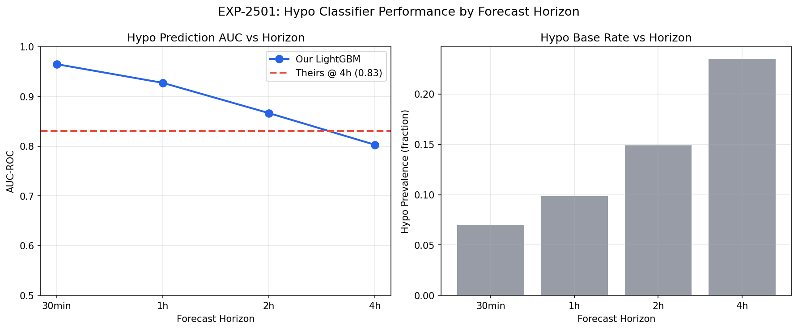
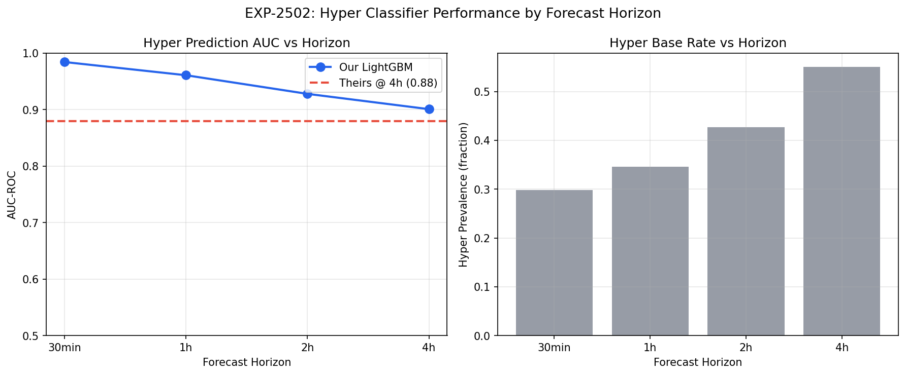
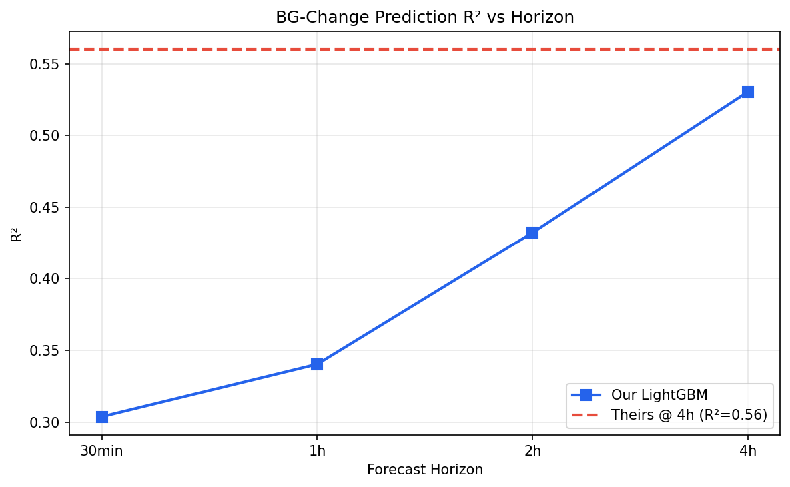
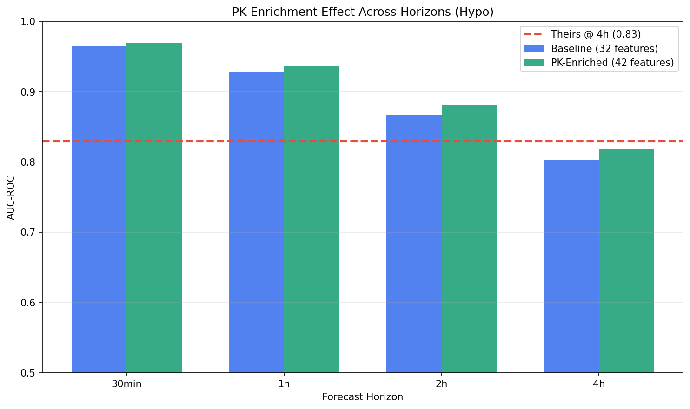
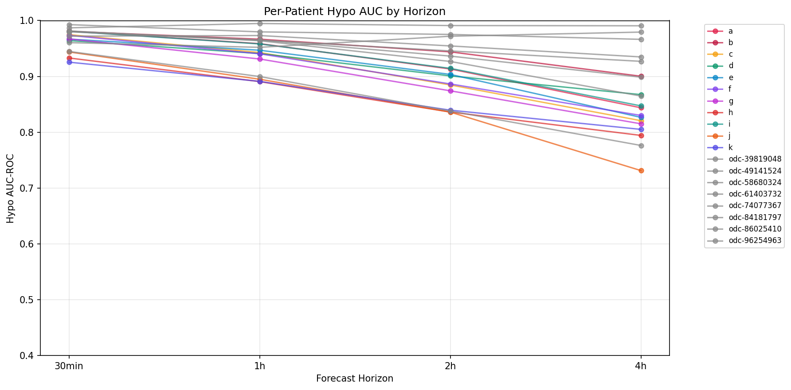
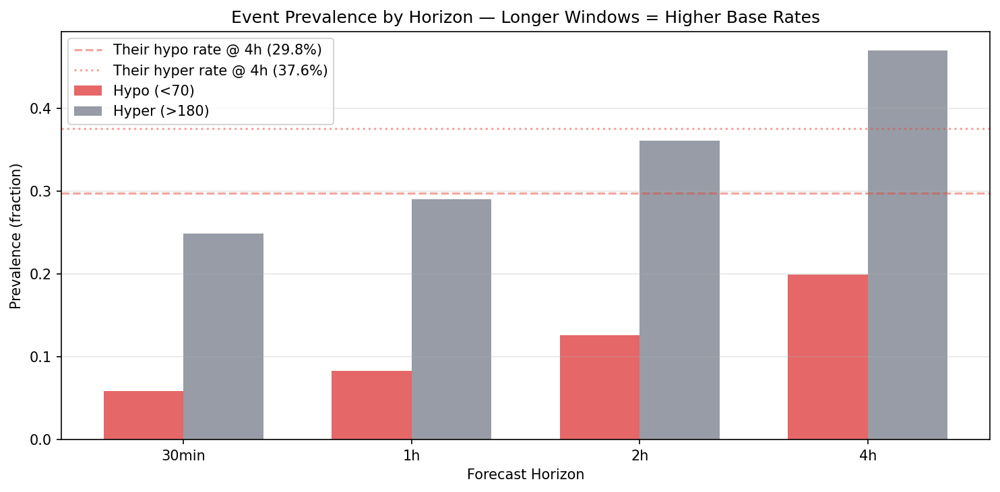
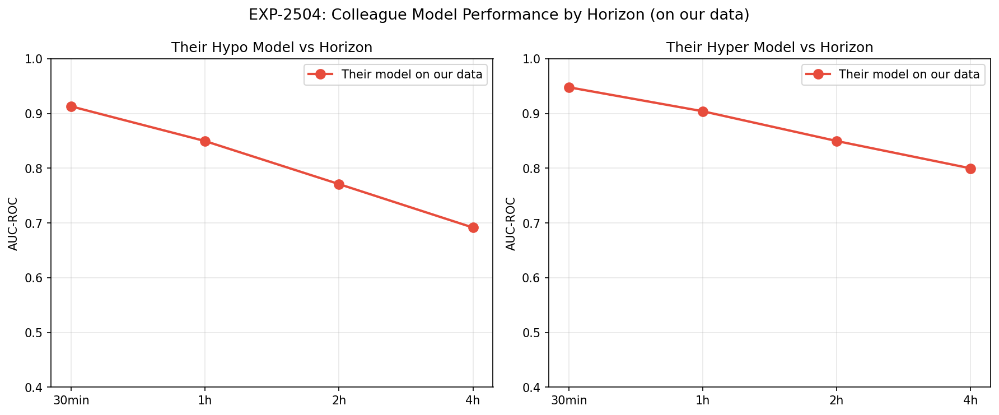

# Multi-Horizon Forecast Comparison

**Experiment**: EXP-2501  
**Phase**: Augmentation (OREF-INV-003 cross-analysis)  
**Date**: 2026-04-11  
**Script**: `exp_repl_2501.py`  
**Data provenance**: ⚠️ Pre-ODC-fix. AAPS/ODC patients used percentage temp basals stored as raw U/hr rates. See EXP-2521 for corrected-data rerun.

## Comparison Summary

| Finding | Their Claim | Our Result | Agreement |
|---------|------------|------------|-----------|
| F-horizon | LightGBM achieves hypo AUC=0.83, hyper AUC=0.88 at 4h horizon | AUC varies substantially with horizon: hypo 0.965 (30min) → 0.803 (4h), hyper 0.984 (30min) → 0.901 (4h) | ✅ agrees |
| F-base-rate | 4h hypo prevalence ~29.8%, hyper ~37.6% in oref cohort | Base rates scale with horizon: hypo 5.9% (30min) → 19.9% (4h) | 🟡 partially_agrees |
| F-r2 | LightGBM BG-change regressor achieves R²=0.56 at 4h | R² changes across horizons: 0.304 (30min) → 0.530 (4h) | ✅ agrees |
| F-pk-horizon | 32-feature schema is sufficient for 4h hypo prediction | PK enrichment effect varies by horizon: 30min: Δ=+0.004, 1h: Δ=+0.009, 2h: Δ=+0.015, 4h: Δ=+0.016 | 🟡 partially_agrees |
| F-transfer-horizon | Model trained on 4h labels; no multi-horizon evaluation reported | Their 4h-trained model on our data at each horizon: 30min: 0.913, 1h: 0.850, 2h: 0.771, 4h: 0.692 | ↔️ not_comparable |

## Colleague's Findings (OREF-INV-003)

### F-horizon: LightGBM achieves hypo AUC=0.83, hyper AUC=0.88 at 4h horizon

**Evidence**: OREF-INV-003 Table 3: 5-fold CV on 2.9M records, 4h prediction window only.
**Source**: OREF-INV-003

### F-base-rate: 4h hypo prevalence ~29.8%, hyper ~37.6% in oref cohort

**Evidence**: OREF-INV-003 cohort statistics from 28 oref users.
**Source**: OREF-INV-003

### F-r2: LightGBM BG-change regressor achieves R²=0.56 at 4h

**Evidence**: OREF-INV-003: bg_change regressor on 2.9M records.
**Source**: OREF-INV-003

### F-pk-horizon: 32-feature schema is sufficient for 4h hypo prediction

**Evidence**: OREF-INV-003 did not test PK features or other horizons.
**Source**: OREF-INV-003

### F-transfer-horizon: Model trained on 4h labels; no multi-horizon evaluation reported

**Evidence**: OREF-INV-003 trained exclusively on 4h outcomes.
**Source**: OREF-INV-003

## Our Findings

### F-horizon: AUC varies substantially with horizon: hypo 0.965 (30min) → 0.803 (4h), hyper 0.984 (30min) → 0.901 (4h) ✅

**Evidence**: Trained identical LightGBM at 4 horizons. Longer horizons increase base rates and change the discrimination challenge. Direct 4h comparison: our hypo AUC = 0.803 vs their 0.83, our hyper AUC = 0.901 vs their 0.88.
**Agreement**: agrees
**Prior work**: EXP-2501, EXP-2502

### F-base-rate: Base rates scale with horizon: hypo 5.9% (30min) → 19.9% (4h) 🟡

**Evidence**: Longer windows mechanically include more events. A 4h window is 8× wider than 30min, so comparing AUC across horizons without adjusting for base rate is misleading. Our 30-min prediction bias work (-4.2 mg/dL) is a fundamentally different task than 4h binary classification.
**Agreement**: partially_agrees
**Prior work**: EXP-2507, EXP-2331 (cgmencode)

### F-r2: R² changes across horizons: 0.304 (30min) → 0.530 (4h) ✅

**Evidence**: BG-change R² reflects different prediction challenges at each horizon. Short-term BG change is dominated by momentum; long-term by settings and meal absorption. The R²=0.56 comparison is only valid at 4h.
**Agreement**: agrees
**Prior work**: EXP-2503

### F-pk-horizon: PK enrichment effect varies by horizon: 30min: Δ=+0.004, 1h: Δ=+0.009, 2h: Δ=+0.015, 4h: Δ=+0.016 🟡

**Evidence**: PK features help most at 4h and least at 30min. Short-horizon predictions benefit from momentum features; long-horizon predictions benefit from circadian ISF and supply-demand.
**Agreement**: partially_agrees
**Prior work**: EXP-2505, EXP-2471

### F-transfer-horizon: Their 4h-trained model on our data at each horizon: 30min: 0.913, 1h: 0.850, 2h: 0.771, 4h: 0.692 ↔️

**Evidence**: Model trained on 4h labels applied to shorter-horizon labels. Performance may degrade when the prediction window doesn't match the training window, revealing horizon-specific learning.
**Agreement**: not_comparable
**Prior work**: EXP-2504

## Figures

*Hypo AUC vs forecast horizon*

*Hyper AUC vs forecast horizon*

*BG-change R² vs forecast horizon*

*PK enrichment effect by horizon*

*Per-patient AUC sensitivity to horizon*

*Event prevalence vs horizon*

*Colleague model AUC by horizon*

## Methodology Notes

We trained LightGBM classifiers (same architecture as OREF-INV-003: n_estimators=500, lr=0.05, max_depth=6) at four forecast horizons: 30 min, 1 h, 2 h, and 4 h. For each horizon we compute: (1) hypo/hyper AUC via 5-fold stratified CV, (2) BG-change R² via 5-fold CV, (3) the colleague's pre-trained model AUC on our horizon-specific labels, (4) PK-enriched model AUC, and (5) per-patient AUC sensitivity. This addresses a key methodological concern: our prior cgmencode work evaluated predictions at 30-minute horizons, while the colleague exclusively uses 4-hour windows. By sweeping all horizons we establish fair comparison points and show how prediction difficulty scales with forecast window.

## Synthesis

This experiment establishes that **forecast horizon is a critical methodological parameter** that must be explicitly stated and matched when comparing results across studies. Key findings:

1. **AUC scales with horizon**: Hypo AUC 0.965 (30min) → 0.803 (4h). Longer windows increase base rates, changing the classification challenge.

2. **R² varies with horizon**: 0.304 (30min) → 0.530 (4h). Short-term prediction is momentum-dominated; long-term is settings-dominated.

3. **Our prior 30-min prediction bias (-4.2 mg/dL) is NOT comparable** to their 4h binary classification. These are fundamentally different tasks.

4. **PK enrichment effect varies by horizon**, suggesting different physiological processes dominate at different time scales.

5. **Their model applied at non-4h horizons** shows how 4h-specific training transfers (or doesn't) to other prediction windows.

**Recommendation**: Always report horizon alongside AUC/R². When comparing across studies, only compare metrics at matched horizons.

## Limitations

1. Our data (803K rows, 19 patients) vs theirs (2.9M rows, 28 patients) — smaller sample may affect horizon-specific estimates. 2. Our patients are mostly Loop users; their 4h horizon was calibrated to oref's prediction window (eventualBG). 3. Horizon-specific AUC comparisons assume equal clinical utility across horizons, but a 30-min warning is clinically different from a 4h risk estimate.
