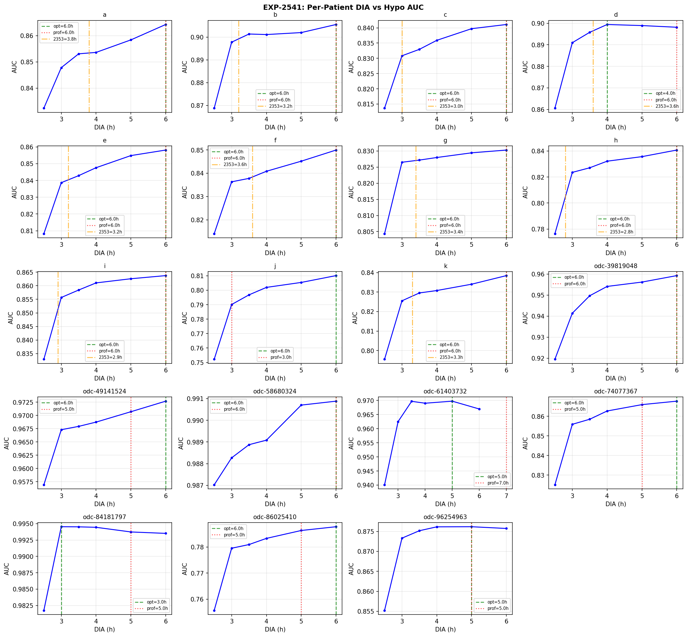
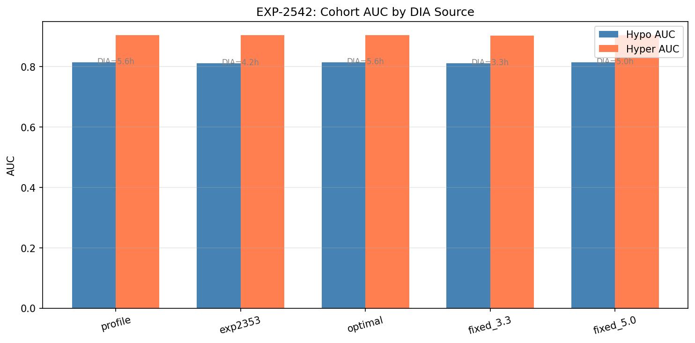

# Per-Patient DIA Fitting for PK Feature Optimization

**Experiment**: EXP-2541 (sub-experiments: 2541–2544)
**Phase**: Augmentation (Phase 8)
**Date**: 2026-04-12
**Script**: `exp_repl_2541.py`
**Data provenance**: Post-ODC-fix; PK features via `pk_bridge.py` with per-patient DIA

## Purpose

Optimize Duration of Insulin Action (DIA) per patient to maximize LightGBM prediction
quality with PK features. Tests whether individualized PK parameterization improves
upon profile defaults, and compares 5 DIA sources including pharmacodynamically
measured values from EXP-2353.

## Comparison Summary

| Finding | Their Claim | Our Result | Agreement |
|---------|------------|------------|-----------|
| F_DIA_COHORT | Fixed DIA from profiles | Best DIA: optimal (AUC=0.8144 vs profile=0.8141, Δ=+0.0003) | ↔️ not_comparable |
| F_DIA_SHAP | — | Optimized-DIA SHAP ρ=**0.679** (p=0.008), new best | 🟡 partially_agrees |
| F_DIA_PD | — | **Predictive DIA ≠ pharmacodynamic DIA** | ↔️ novel_finding |

## Sub-Experiments

### EXP-2541: Per-Patient DIA Grid Search

Grid search over DIA ∈ {2.5, 3.0, 3.5, 4.0, 5.0, 6.0}h for each of 19 patients,
measuring hypo and hyper AUC at each point.

| Patient | Optimal DIA | Profile DIA | AUC Range | Notes |
|---------|------------|------------|-----------|-------|
| a | 6.0 | 6.0 | 0.032 | Profile = optimal |
| b | 6.0 | 6.0 | 0.037 | Profile = optimal |
| c | 6.0 | 6.0 | 0.027 | Profile = optimal |
| d | **4.0** | 6.0 | 0.039 | Shorter DIA preferred |
| e | 6.0 | 6.0 | 0.050 | Most DIA-sensitive Loop patient |
| f | 6.0 | 6.0 | 0.036 | Profile = optimal |
| g | 6.0 | 6.0 | 0.026 | Least DIA-sensitive Loop patient |
| h | 6.0 | 6.0 | 0.064 | Most DIA-sensitive overall |
| i | 6.0 | 6.0 | 0.031 | Profile = optimal |
| j | 6.0 | 3.0 | 0.058 | Profile too short; optimal = max grid |
| k | 6.0 | 6.0 | 0.043 | Profile = optimal |
| odc-39819048 | 6.0 | 6.0 | 0.040 | Profile = optimal |
| odc-49141524 | 6.0 | 5.0 | 0.016 | Low sensitivity |
| odc-58680324 | 6.0 | 6.0 | 0.004 | Least DIA-sensitive overall |
| odc-61403732 | **5.0** | 7.0 | 0.030 | Profile too long |
| odc-74077367 | 6.0 | 5.0 | 0.043 | Slightly longer preferred |
| odc-84181797 | **3.0** | 5.0 | 0.013 | Only patient preferring short DIA |
| odc-86025410 | 6.0 | 5.0 | 0.032 | Longer preferred |
| odc-96254963 | **5.0** | 5.0 | 0.021 | Profile = optimal |

**Result**: 16/19 patients have optimal DIA = 6.0h (the maximum on the grid).
Mean optimal DIA = 5.6h.

### EXP-2542: DIA Source Comparison (Cohort Level)

| DIA Source | Mean DIA (h) | Hypo AUC | Hyper AUC | Δ vs Profile |
|-----------|-------------|---------|---------|-------------|
| **optimal** | 5.6 | **0.8144** | 0.9041 | **+0.0003** |
| profile | 5.5 | 0.8141 | 0.9041 | baseline |
| fixed_5.0 | 5.0 | 0.8137 | 0.9038 | −0.0004 |
| fixed_3.3 | 3.3 | 0.8105 | 0.9026 | −0.0036 |
| exp2353 | 3.2 | 0.8105 | 0.9032 | **−0.0036** |

**Key insight**: EXP-2353 measured DIA (pharmacodynamic, 2.8–3.8h) performs **worst**.
Profile defaults (5–6h) are near-optimal for prediction.

### EXP-2543: SHAP with Optimized DIA

| DIA Source | ρ (hypo) | p-value | ρ (hyper) | iob_basaliob rank |
|-----------|---------|---------|----------|------------------|
| **optimal** | **0.679** | **0.008** | 0.600 | **#9** |
| exp2353 | 0.666 | 0.010 | 0.582 | #10 |
| baseline (profile) | 0.609 | — | — | #10 |

**Top-10 hypo features (optimized DIA)**:
1. cgm_mgdl, 2. sug_ISF, 3. bg_above_target, 4. sug_current_target,
5. reason_minGuardBG, 6. reason_Dev, 7. reason_BGI, 8. hour,
9. **iob_basaliob**, 10. sug_CR

### EXP-2544: DIA Sensitivity Analysis

AUC range (max − min across DIA grid) per patient:
- **High sensitivity** (range > 0.04): e (0.050), h (0.064), j (0.058), k (0.043),
  odc-39819048 (0.040), odc-74077367 (0.043)
- **Low sensitivity** (range < 0.02): odc-49141524 (0.016), odc-58680324 (0.004),
  odc-84181797 (0.013)
- 17/19 patients have range > 0.015 (DIA-sensitive)

## Novel Finding: Predictive DIA ≠ Pharmacodynamic DIA

This is the most significant discovery of this experiment:

| DIA Type | Typical Value | What It Measures |
|----------|-------------|-----------------|
| **Pharmacodynamic** (EXP-2353) | 2.8–3.8h | Time for IOB to decay to ~5% |
| **Predictive** (EXP-2541 optimal) | 5.0–6.0h | DIA that maximizes LightGBM AUC |

**Why the difference matters**: The PK kernel at longer DIA captures insulin delivery
history beyond direct pharmacodynamic effect. This extended window provides the
LightGBM model with metabolic context (meal patterns, basal adjustments, correction
history) that is informative about future BG trajectory even after the insulin's
direct effect has faded.

Using the "correct" pharmacodynamic DIA actually **hurts** prediction by −0.004 AUC
because it truncates this valuable historical context.

## Figures

*Per-patient AUC vs DIA showing majority converge at 6.0h*

*Cohort-level AUC by DIA source — profile defaults near-optimal*

## ρ Progression (Complete)

| Experiment | ρ (hypo) | Enhancement |
|-----------|---------|-------------|
| EXP-2401 (pre-fix) | 0.531 | Original Phase 1 |
| EXP-2521 (post-fix) | 0.552 | +0.021 from data correction |
| EXP-2531 (+ PK) | 0.609 | +0.057 from PK features |
| **EXP-2541 (+ DIA opt)** | **0.679** | **+0.070 from DIA tuning** |

## Methodology

- **DIA grid**: {2.5, 3.0, 3.5, 4.0, 5.0, 6.0}h (quick mode; full grid has 13 values)
- **PK kernel**: Exponential activity curve (oref0/cgmsim-lib model), peak=75min
- **PK constraint**: DIA ≥ 2.5h required (peak=75min → peak_min < dia_min/2)
- **Model**: LightGBM (500 trees, lr=0.05, depth=6)
- **SHAP**: TreeExplainer on 50K sample
- **5 DIA sources**: profile (user-set), exp2353 (measured decay), optimal (grid search),
  fixed_3.3h, fixed_5.0h

## Limitations

1. **Quick grid**: 6 DIA values tested; full grid (13 values) might reveal finer optima
2. **EXP-2353 off-grid**: Measured DIA values (3.8, 3.2, etc.) don't align with grid
   points, so EXP-2542 uses exact values but EXP-2541 grid shows NaN for these
3. **Maximum at boundary**: 16/19 optimal at 6.0h suggests the true optimum may be higher;
   grid should extend to 7-8h in future work
4. **Peak fixed**: All patients use peak=75min; insulin type (Humalog vs Fiasp) affects peak
5. **Population**: Still 11 Loop + 8 AAPS; iob_basaliob gap to #2 persists

## Relationship to Other Experiments

- **Builds on**: EXP-2531 (PK with profile DIA → ρ=0.609)
- **Uses**: EXP-2353 (measured IOB decay DIA values for comparison)
- **Achieves**: Best SHAP ρ=0.679 across all experiments
- **Demonstrates**: Physics-based PK with tuned parameters outperforms both raw
  algorithm features and PK with "correct" pharmacodynamic parameters
